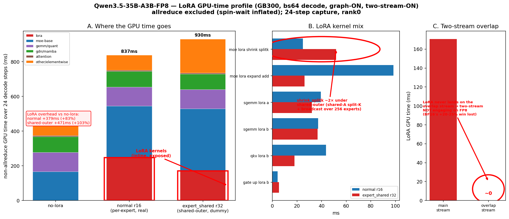

# Qwen3.5-35B-A3B-FP8 — LoRA decode overhead & two-stream overlap (GB300)

Profiles: `bench_one_batch_server` bs64, in/out 2048, **graph-ON, two-stream-ON** (`SGLANG_EXPERIMENTAL_LORA_OPTI=1` + overlap envs), commit `526e0ae22`, flashinfer 0.6.11.post1, TP4/EP4, rank0 trace, 24-step decode capture. Torch profiler (CPU+GPU).

Raw traces: `runs/Qwen3.5-35B-A3B-FP8/20260608-205829/` (no-lora + normal r16) and `runs/Qwen3.5-35B-A3B-FP8-expert_shared/20260608-212300/` (no-lora + expert_shared r32).

## How to read it (allreduce caveat)
`all_reduce_two_shot` is **75–87% of raw GPU-time but is spin-wait inflated** (the two-shot kernel busy-waits for peer ranks; its "duration" ≈ inter-rank skew, not compute). So all numbers below **exclude allreduce** and use *non-allreduce GPU compute over the 24-step window*. Both lora cells share an identical no-lora baseline (~458 ms), so within-run deltas are clean.

## Findings

**1. Two-stream LoRA overlap is NOT engaging on the FP8 path.** The overlap side-stream (CUDA stream 160) carries only PyTorch housekeeping (`CatArrayBatchedCopy`, copy/fill/index_put) — **0 LoRA kernels**. All LoRA kernels run **inline on the main stream (128)**, fully exposed. The BF16 +20–25% two-stream win (PR #4 30B matrix) does **not** transfer to FP8 here. (Streams are captured separately, so this is real, not a cuda-graph attribution artifact.)

**2. LoRA decode overhead (non-allreduce compute, vs each run's own no-lora):**

| config | no-lora | lora | LoRA overhead |
|---|---|---|---|
| normal r16 (per-expert, real adapter) | 458 ms | 837 ms | **+379 ms (+83%)** |
| expert_shared r32 (shared-outer, dummy) | 459 ms | 930 ms | **+471 ms (+103%)** |

Shared-outer r32 adds **~24% more** exposed overhead than normal per-expert r16.

**3. Where shared-outer's extra cost lives — NOT the LoRA GEMMs.** Shared-outer actually has *fewer* `_lora`-named kernel ms (170.7 vs 247.8), but more total compute, because the cost moves into:
- **`other/elementwise` +109 ms** (196 vs 87 ms) — reshape/broadcast of the shared A/B across 256 experts.
- **`moe-base` +62 ms** (358 vs 296 ms) — the shared-outer MoE path.
- **`_moe_lora_shrink_splitk` ~2×** (51.9 vs 24.8 ms) — the shared outer-A split-K projection.

## Why "expert_shared + rank32" feels much slower
- **rank 16→32 is minor** (~2–4%); the bench shows shared-outer r16 ≈ r32.
- The real cost is the **shared-outer layout** (broadcast/reshape + heavier moe-base + split-K shrink), **fully exposed** because two-stream overlap doesn't engage on FP8.
- If you compared against the no-lora ceiling, that's where the large gap comes from (LoRA cell ≈ 73–80% of ceiling; see PR #4 bench tables).

## Caveats
- normal r16 = **real** adapter (`qwen35_35b_lora_alpha`, all-linear incl. GDN `in_proj_qkvz` + `lm_head`); expert_shared r32 = **dummy** (q/k/v/o/gate/up/down only). So the normal-vs-shared-outer absolute comparison mixes **module coverage + rank + layout**. The dummy covers *fewer* modules yet costs *more* — which strengthens "shared-outer layout is the heavier path." A strictly layout-isolated number needs matched coverage + rank (per-expert dummy r32 with the same targets) — not run here.
- Profiling methodology (answering "do I need graph + two-stream on?"): **yes to both** — graph-ON gives the real decode kernel schedule; two-stream-ON is required for the overlap to exist at all (it's what we're measuring). Measure overlap rate from the two-stream-ON trace; measure the overlap *benefit* by also profiling two-stream-OFF (or use the bench A/B).
