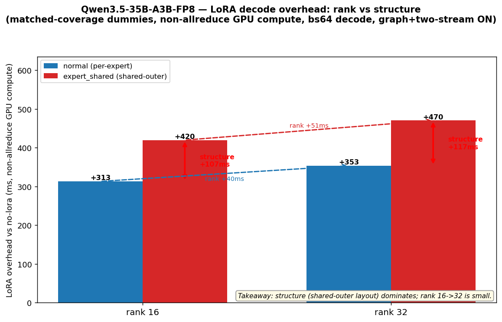

# Qwen3.5-35B-A3B-FP8 — LoRA decode overhead: rank vs structure (clean 2×2)

Goal: separate **rank** cost from **expert_shared structure (layout)** cost. To remove the
real-vs-dummy / module-coverage confound, **all four configs use auto-generated dummies with the
SAME `DL_TARGETS` (q,k,v,o,gate,up,down_proj)** — only LoRA *layout* (per-expert vs shared-outer)
and *rank* (16 vs 32) differ. GB300, TP4/EP4, bs64 decode, graph-ON + two-stream-ON, commit `526e0ae22`,
rank0 trace, 24-step capture. Metric = LoRA overhead = (lora − no-lora) **non-allreduce GPU compute**
(allreduce is spin-wait inflated and ≈equal across cells; each cell's own no-lora ≈ 455 ms).

## 2×2 — LoRA overhead vs no-lora (ms)

| | normal (per-expert) | expert_shared (shared-outer) | **structure = eso − normal** |
|---|---|---|---|
| **rank 16** | +313 | +420 | **+107** |
| **rank 32** | +353 | +470 | **+117** |
| **rank = r32 − r16** | **+40** | **+51** | |

## Conclusion
- **The expert_shared *structure* dominates the overhead, not the rank.** Holding rank + coverage fixed,
  shared-outer adds **+107 ms (r16) / +117 ms (r32)**; bumping rank 16→32 adds only **+40 ms (normal) /
  +51 ms (shared-outer)**. Structure is ~2.3–2.5× the rank effect.
- So "expert_shared + r32 is much slower" is mostly the **shared-outer layout**, with rank a minor add-on.

## Why the shared-outer layout costs more (from the kernel breakdown, see the sibling
`Qwen3.5-35B-A3B-FP8-lora-overhead/` analysis)
- The extra time is **not** in the LoRA GEMMs (shared-outer actually has fewer `_lora` GEMM ms). It is in
  **elementwise/reshape (broadcasting the shared A/B across 256 experts) + a heavier moe-base path**, and
  `_moe_lora_shrink_splitk` roughly doubles (the shared outer-A split-K).
- And it is **fully exposed**: on FP8 the two-stream LoRA overlap does not engage (LoRA kernels run inline
  on the main stream; the overlap side-stream carries 0 LoRA), so the BF16 +20–25% two-stream win is lost here.

## Method note (profiling knobs)
Profile with **CUDA graph ON** (real decode schedule) and **two-stream ON** (the overlap must exist to
measure it). Measure overlap from the two-stream-ON trace; measure the overlap *benefit* by also profiling
two-stream-OFF (or use the bench A/B). Raw traces of all 4 cells are under
`runs/Qwen3.5-35B-A3B-FP8-{normal_dummy,expert_shared}/` (normal_dummy uploaded rank0).
