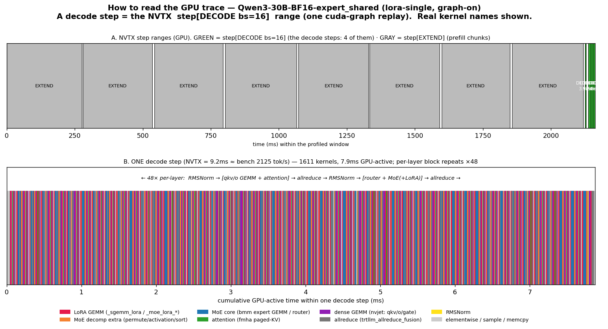

# How to read these GPU traces (where is one decode step?)



Open `*/bs16-TP-0.trace.json.gz` in **https://ui.perfetto.dev**. There are two useful tracks: the
**NVTX annotation track** (step ranges) and the **GPU/CUDA stream track** (kernels, here `stream 128`).

## Use the NVTX `step[...]` ranges — don't count kernels
The trace already annotates every step:
- **`step[DECODE bs=16]`** — a real decode step (this run has **4** of them).
- **`step[EXTEND bs=2 toks=4096]`** — a prefill chunk (this run has **8**; they dominate the window).
- `## Call CompiledFxGraph … ##` — the cuda-graph replay; **one decode step = one graph replay**.

So **a decode step = one `step[DECODE bs=16]` range**. (NVTX is step-level only — there is **no**
per-layer / per-module NVTX, so layer/attention/MoE labels below come from kernel names.)

## Timing is real per decode step
Each `step[DECODE bs=16]` ≈ **7.5 ms** for lora-single — which **matches the non-profiled bench
(2125 tok/s = 16/7.5 ms)**. So per-decode-step timing in the trace is representative. (The profiled
*run's* overall throughput is low only because of profiler setup/flush + the 8 prefill chunks; the
individual decode steps run at normal speed.)

## Inside one decode step: 48 layers
The per-layer block repeats **×48** (count `moe::dev::routing::routingCustom::routingIndices` → 48, or
`fmha` attention → 48). Per-layer kernels (cuda-graph ON, decode):
```
attention(fmhaSm100f, paged-KV) → O-proj GEMM(nvjet) → allreduce(trtllm_allreduce_fusion, also does residual+RMSNorm)
   → gate GEMM(nvjet) → router(routingCustom) → expert GEMM(bmm_Bfloat16) → finalize → allreduce → (next layer)
```
**Note:** RMSNorm is **fused into the `trtllm_allreduce_fusion` kernel** (only ~2 standalone `RMSNorm`
in a whole step), so the layer marker is `fmha` (attention) or the router, not a norm.

## The figure
- **Panel A** — the NVTX step ranges. GREEN = the 4 `step[DECODE bs=16]`; GRAY = the 8 `step[EXTEND]`
  prefill chunks (much longer). Decode steps are the short green ones at the end.
- **Panel B** — one decode step, kernels packed by GPU-active time, colored by phase (real kernel
  names in the legend). The MoE+attention block repeats ×48.

## ⚠️ Caveat (allreduce)
`trtllm_allreduce_fusion` / `all_reduce_one_shot_push_kernel` durations are **spin-wait inflated**
(they wait for peer ranks). They look huge but aren't real compute — our analysis excludes them and
uses non-allreduce GPU time + the non-profiled bench tok/s.

## For the LoRA cells
Same step/layer structure; the MoE part gains the decomposed kernels (`permute`, `activation`,
`count_and_sort`, `moe_align`, `fused_moe`) **and** the `_sgemm_lora_*` / `_moe_lora_*` GEMMs — see
`ONE_LAYER.md` and `OPTIMIZATION.md`.
