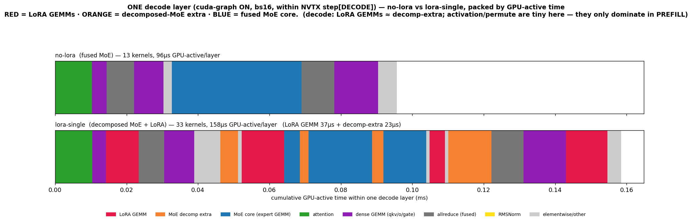

# One decode layer — no-lora vs lora (where LoRA inserts), cuda-graph ON, bs16

Both rows = **one transformer layer inside a real `step[DECODE bs=16]`** (anchored on the per-layer
`fmha` attention), kernels packed by GPU-active time, same x-scale.

- **no-lora (top): 96 µs/layer, 13 kernels.** Compact: attention(green) → O-proj GEMM(purple) →
  allreduce(gray, fused: +residual+RMSNorm) → gate GEMM → **fused MoE core (blue `bmm`)** → allreduce.
- **lora-single (bottom): 158 µs/layer, 33 kernels (+62 µs).** In the MoE region LoRA inserts
  **RED = LoRA GEMMs (37 µs:** `_sgemm_lora_a/b`, `_moe_lora_shrink/expand`, `_qkv_lora_b`**)** and
  **ORANGE = decomposed-MoE extra (23 µs:** `fused_moe`, `moe_align`, `activation`, `permute`**)**, and
  the blue fused core shrinks. The attention half (green + purple) is unchanged.

## Takeaway (DECODE)
At decode, the +62 µs/layer splits **LoRA GEMMs (37 µs) ≳ decomp-extra (23 µs)** — they're comparable,
LoRA GEMMs slightly larger. **`activation` and `permute` are tiny at decode** (they only blow up in
PREFILL, where 4096 tokens flow through them). See `OPTIMIZATION.md`.
