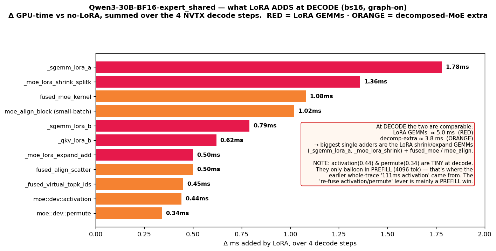

# Optimization analysis — LoRA decode overhead (CORRECTED: decode-only, via NVTX step[DECODE])

**Correction:** an earlier version of this file summed the **whole trace**, which is **8 prefill
(`step[EXTEND]`, 4096 tok) chunks + only 4 decode steps** → it was **prefill-dominated** (that's where
the "activation 111 ms / permute 74 ms" came from). Below is the **decode-only** picture (kernels
inside the 4 `step[DECODE bs=16]` NVTX ranges).

## What LoRA adds at DECODE (bs16), Δ vs no-LoRA, summed over 4 decode steps
| kernel | Δ ms | group |
|---|---|---|
| `_sgemm_lora_a` | 1.78 | LoRA GEMM |
| `_moe_lora_shrink_splitk` | 1.36 | LoRA GEMM |
| `fused_moe_kernel` | 1.08 | decomp |
| `moe_align_block (small-batch)` | 1.02 | decomp |
| `_sgemm_lora_b` | 0.79 | LoRA GEMM |
| `_qkv_lora_b` | 0.62 | LoRA GEMM |
| `_moe_lora_expand_add` | 0.50 | LoRA GEMM |
| `fused_align_scatter` / `virtual_topk` | 0.95 | decomp |
| `moe::dev::activation` | 0.44 | decomp |
| `moe::dev::permute` | 0.34 | decomp |
| **LoRA GEMMs total** | **~5.1 ms** | |
| **decomp-extra total** | **~3.8 ms** | |

→ **At decode the two are comparable (LoRA GEMMs ≳ decomp-extra).** Per layer: +62 µs = ~37 µs LoRA
GEMMs + ~23 µs decomp-extra (no-lora layer 96 µs → lora 158 µs). Step-level this is the 4273→2125 tok/s
(no-lora→lora-single) drop.

## Optimization levers (ranked, for DECODE)
1. **LoRA GEMMs are now the #1 chunk** — `_sgemm_lora_a` (shrink A) + `_moe_lora_shrink_splitk` are the
   biggest. Fuse shrink+expand, and/or the CUBLAS path (`SGLANG_OPT_LORA_CUBLAS*`), to cut these.
2. **`fused_moe` + `moe_align` (small-batch)** — the decomposed expert GEMM + block alignment; at bs16
   these are fixed-cost heavy. Fuse the LoRA delta into the expert GEMM so a separate `fused_moe`
   isn't needed.
3. **Two-stream overlap** — on BF16 two-stream already gives +17% decode (single 2125 → two 2481);
   LoRA kernels spread onto ~90 side streams. More of the MoE could be overlapped. (On FP8 two-stream
   does **not** engage yet — a separate win.)
4. **`activation` / `permute`** — small at decode; **fusing them is mainly a PREFILL win** (there they
   are the dominant LoRA cost). Worth it if prefill/TTFT matters.
5. **Batch size** — bs16 is fixed-cost-bound; LoRA fraction shrinks at larger bs.

## Method note
Wall-clock decode tok/s is the headline metric. cuda-graph ≈ 13–17× at bs16 (launch-bound).
allreduce excluded (spin-wait inflated). All decode numbers are from kernels inside `step[DECODE bs=16]`.
